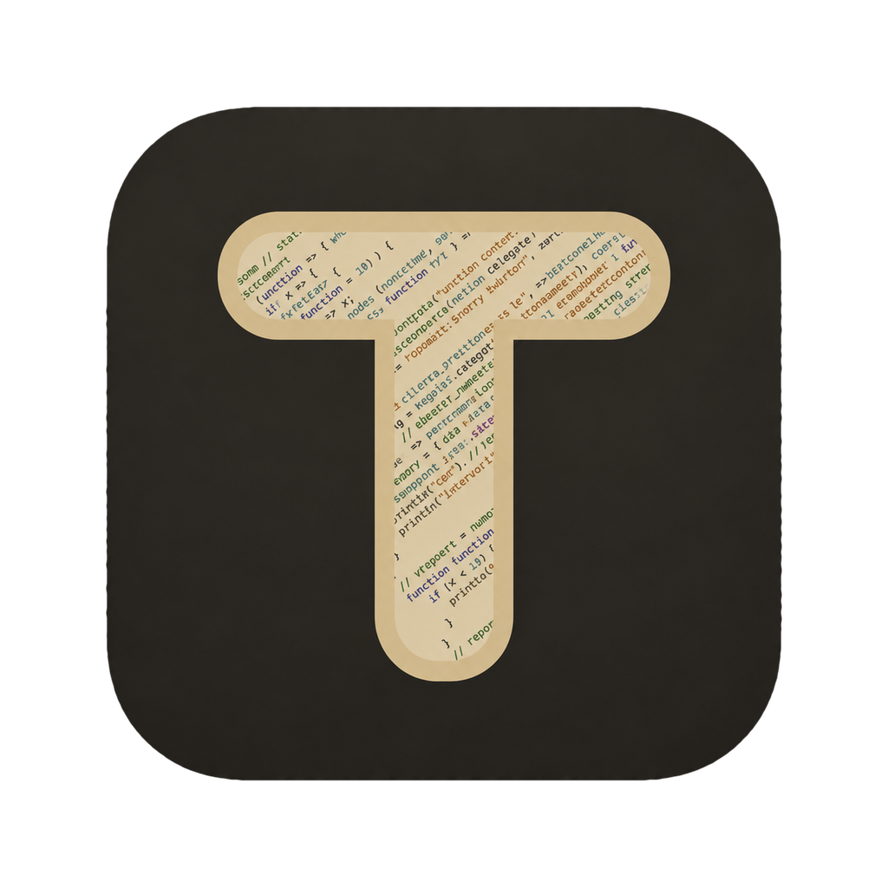

# TodeX 桌面端 (`TodeX_desktop`)

<p align="center">
  <picture>
    <source media="(prefers-color-scheme: dark)" srcset="src/renderer/assets/brand/t-icon-dark-beige.png" />
    <source media="(prefers-color-scheme: light)" srcset="src/renderer/assets/brand/t-icon-light.png" />
    
  </picture>
</p>

正式打包版本支持 GitHub Release 自动更新，详见[自动更新与发布配置](docs/automatic-updates.md)。

<p align="center">
  <strong>基于 Electron、React 19 与 HeroUI Pro 构建的原生 macOS 桌面客户端，连接 <code>todex-agentd</code>。</strong>
</p>

<p align="center">
  <a href="README.md">English</a> •
  <a href="README.zh-CN.md">简体中文</a>
</p>

---

## 概述

**TodeX Desktop** 是连接 [`todex-agentd`](../TodeX_backend) 后端服务的桌面客户端，为 macOS 开发者提供沉浸式编程工作台。

桌面端采用 **Electron 44**、**React 19**、**Vite 7**、**Tailwind CSS v4** 和 **HeroUI Pro** 构建，设计了专为宽屏优化的经典三栏工作台布局。它与 Web 客户端共享核心通信协议库（`@todex/protocol`，来自 [`TodeX_protocol`](../TodeX_protocol)），同时充分利用桌面端原生能力，如系统原生目录选择器、拖拽二维码图片解码以及多标签页开发者工作台。

---

## 核心特性

- **桌面三栏工作台界面**：
  - **左侧边栏（Sidebar）**：工作区目录管理、会话历史列表、Agent 标识徽章、会话生命周期操作（新建、重命名、Fork、删除）与快速设置。
  - **中央聊天面板（Chat Panel）**：完整会话时间线、流式 Markdown 实时渲染、Shiki 语法高亮、KaTeX 数学公式渲染、交互式审批卡片（命令执行、文件变更对比、工具调用），以及支持模型搜索选择（按名称匹配，不区分大小写）、可拖动思考强度、Codex Fast 模式、两级 `@` 引用菜单（先选类型再搜索：`@file:`、`@folder:`、`@chat:` 将工作区内其他对话导出为 Markdown 附加、`@skill:`、`@mcp:`）、`/` 斜杠命令与 `#` Skill/MCP 建议的输入框。推理与工具详情仅在用户展开后按需挂载，最终答复与上下文、执行事件保持独立。
  - **右侧工作台面板（Workbench Panel）**：
    - **斜杠命令（Slash Commands）**：快速查看与调用当前 Agent 的可用命令。
    - **Git Diff**：工作区实时代码改动差异检查。
    - **终端（Terminal）**：基于 xterm.js 的交互式 PTY 会话，支持原始键盘输入、ANSI 输出与行列尺寸自动同步。
    - **能力目录（Capabilities）**：实时查看当前生效的 Skills 与 MCP Servers。
    - **浏览器（Browser）**：以原生视图打开本机回环页面与工作区 HTML 文件（独立的 `persist:todex-preview` 分区），元素拾取会把引用写入聊天草稿。
    - **Agent 浏览器**：开启 Agent 桌面工具后，实时显示当前会话的 Agent 在后端所在电脑上操作的浏览器标签（经会话连接推送画面），附最新一步操作与“停止”按钮。
  - **终端视图（侧边栏）**：管理后端主机的 SSH 主机（自动读取 `~/.ssh/config`、手动添加/导入、连接测试、按主机开启 Agent 访问）、SSH 密钥（查看、导入、生成）与 FTP 站点；在右侧工作台中打开 SSH 终端和 SFTP/FTP 文件浏览。
    - **实验特性（Experiments）**：特性开关与开发者诊断面板。
- **配对与连接管理**：
  - 查看当前后端连接的 Codex、Pi、Claude Code、Grok Build 与 ACP CLI，比较当前/最新版本，一键安装缺失的 CLI 或升级受管 CLI。
  - Agent 账户支持按 Agent 导出/导入供应商 JSON 文件，便于多台主机同步（文件含明文密钥）。
  - 支持通过主机/端口直接连接；请求使用设备验证登记的设备密钥签名。
  - [设备验证](docs/device-verification.md)（配对 v3，先承诺后揭示）：先导入后端配对二维码（固定传输公钥），再与后端 TUI 核对随机验证码并批准一次，即登记此设备的签名密钥。
  - 支持粘贴配对 JSON 文本或多段分片二维码数据。
  - **拖拽二维码图片配对**：支持直接将二维码截图/图片拖入应用窗口（基于 `jsqr` 本地解码）。
  - 分类明确的连接诊断状态（清晰展示后端未启动、端口错误、Token 失效、已废弃的 `/v1` 协议或握手异常等原因）。
- **原生系统深度集成**：
  - 安全隔离的 Electron 架构：开启 Preload 上下文隔离（`contextIsolation: true`），禁用渲染进程 Node 集成（`nodeIntegration: false`）。
  - 本地工作区支持调用 macOS 原生系统文件夹选择对话框。
  - 数据安全保存在 Electron `userData` 目录中（`todex.desktop.*`）。
- **Agent 桌面工具**（`todex_desktop` MCP，在设置中按后端开启）：
  - **Agent 浏览器**（`browser_*`）由后端执行：在后端所在的电脑上打开 Chromium 窗口（因此 `localhost` 指那台电脑），本应用只在工作台中实时观看。会话首次使用可由任意已配对设备确认。顶层页面只允许回环地址；拒绝下载与网站权限请求；向密码框输入前会先询问。
  - 设置中显示后端的 Chromium（可在那里下载）以及按工作区划分的浏览器资料（切换、新建、删除，连同 Cookie、存储与缓存）；浏览器曾在本应用运行时留下的数据也可在此清除。
  - **Computer Use**（`computer_*`）由后端在其所在的电脑上执行，不在本机执行：本应用在输入框上方显示那台电脑的实时画面（无法获取实时画面时显示最新截图）和“停止”按钮；设置中显示后端主机的开关与屏幕录制 / 辅助功能授权状态，并可在那台电脑上请求授权。每个会话的首次使用需由那台电脑前的人确认。
- **后量子传输加密**（[transport v2](docs/device-verification.md#传输加密transport-v2)）：
  - 集成 `@noble` 密码学套件，以配对时固定的后端公钥做 **X25519** 或 **ML-KEM-768**（后量子）密钥协商，每个会话密钥都混入服务端新鲜随机数。
  - 固定了公钥时所有通信都加密，回环地址也一样：WebSocket 使用 `tv=2` 二进制帧，所有 REST 请求经 `POST /v2/sealed` 隧道。只有 `/health`、`/v2/transport-policy` 与设备验证直接请求。
  - 未固定公钥时只能以明文连接回环地址上的后端；连接远程地址会被拒绝并提示加密配对。后端改变加密方式时提示重新配对，不会降级为明文。
- **端到端加密历史**（[历史记录加密](docs/device-verification.md#历史记录加密)）：会话历史始终加密，没有开关。每台设备首次连接时自动登记自己的历史密钥；未设置恢复密钥时设置页会一直提醒。加密之前保存的旧对话只读（可查看、导出、归档、删除）。

---

## 架构设计与移动端关系

```
+-----------------------------------------------------------------------------------+
|                                  TodeX Desktop                                    |
|                                                                                   |
|  +-----------------------------------------------------------------------------+  |
|  |                            Electron 主进程与 Preload                         |  |
|  |       (IPC 通信, 系统对话框, 本地安全存储, 窗口生命周期管理)                |  |
|  +-----------------------------------------------------------------------------+  |
|                                         |                                         |
|  +-----------------------------------------------------------------------------+  |
|  |                             React 19 渲染进程                               |  |
|  |  +-------------------+  +------------------------+  +--------------------+  |  |
|  |  |     左侧边栏      |  |      中央聊天面板      |  |     右侧工作台     |  |  |
|  |  | (工作区与会话列表)|  | (时间线, 流式渲染, 审批)|  | (Git Diff, PTY,    |  |  |
|  |  |                   |  |  输入框建议与附件)      |  |  Skills, MCPs)     |  |  |
|  |  +-------------------+  +------------------------+  +--------------------+  |  |
|  |  +-----------------------------------------------------------------------+  |  |
|  |  |                   HeroUI React & HeroUI Pro UI 组件库                 |  |  |
|  |  +-----------------------------------------------------------------------+  |  |
|  +-----------------------------------------------------------------------------+  |
|                                         |                                         |
|  +-----------------------------------------------------------------------------+  |
|  |              @todex/protocol (共享协议层, 来自 TodeX_protocol)             |  |
|  |         (v2 客户端, 传输层, 心跳探测, 加密协商, 连接健康检测)               |  |
|  +-----------------------------------------------------------------------------+  |
+-----------------------------------------------------------------------------------+
                                          |
                               WebSocket / REST /v2
                                          v
+-----------------------------------------------------------------------------------+
|                             todex-agentd (后端服务)                              |
+-----------------------------------------------------------------------------------+
```

### 桌面端与移动端对照

| 维度 | 移动端 (`Todex_mobile`) | 桌面端 (`TodeX_desktop`) |
| :--- | :--- | :--- |
| **基础框架** | Swift + UIKit | Electron 44 + React 19 (Vite) |
| **UI 组件库** | UIKit（Liquid Glass） | `@heroui/react` + `@heroui-pro/react` (Tailwind v4) |
| **界面布局** | 移动端堆叠导航（Stack Navigation） | 三栏可调节桌面工作台布局 |
| **协议层实现** | Swift 实现（`TodexCore`） | `@todex/protocol` 路径别名映射至 `../TodeX_protocol/src` |
| **本地持久化** | iOS Keychain / 本地持久化 | Electron `userData` JSON 文件（`todex.desktop.*`）；设备密钥与历史密钥由系统钥匙串（safeStorage）加密 |
| **配对输入** | 手机摄像头实时扫描二维码 | 文本粘贴 / 图片拖拽二维码本地解码 |

---

## 前置条件与环境配置

### 环境要求

- **Node.js**：22.0.0 或更高版本
- **pnpm**：11.0.0 或更高版本
- **TodeX 后端**：正在运行的 `todex-agentd` 实例（默认 `http://127.0.0.1:7345`）
- **HeroUI Pro 凭据**：安装 `@heroui-pro/react` 时需要配置授权 Token。

### 1. 配置 HeroUI Pro Token

在运行 `pnpm install` 前，确保在当前 Shell 环境中设置了 Token 变量：

```bash
export HEROUI_AUTH_TOKEN="你的_heroui_key"
# 或者使用已有的 HEROUI_KEY 变量：
export HEROUI_AUTH_TOKEN="$HEROUI_KEY"
```

> [!WARNING]
> 请勿将敏感密钥或 Token 提交至 Git 仓库。

### 2. 安装依赖

```bash
pnpm install
```

*说明：如果 Electron 预编译二进制下载意外中断，可执行以下命令重新下载：*

```bash
rm -rf node_modules/electron/dist
node node_modules/electron/install.js
```

### 3. 启动本地开发

```bash
pnpm run dev
```

启动后会弹出 1280×800 尺寸的桌面客户端窗口。

---

## 常用脚本命令

| 脚本命令 | 说明 |
| :--- | :--- |
| `pnpm run dev` | 执行前置检查并在 Vite 开发模式下启动 Electron 应用。 |
| `pnpm run build` | 编译构建主进程、Preload 脚本及渲染进程生产资源。 |
| `pnpm run package` | 使用 electron-builder 编译并打包 Electron 应用。 |
| `pnpm run preview` | 本地预览生产构建产物。 |
| `pnpm run typecheck` | 执行全工程 TypeScript 类型静态检查。 |
| `pnpm run check:electron` | 校验本地 Electron 二进制文件完整性。 |
| `pnpm run test:updates` | 更新策略与 Linux 桌面入口的单元测试。 |

## 桌面端发布

桌面安装包通过 **Actions > Release desktop packages** 手动发布。输入 `1.2.3`
这样的稳定语义版本后，工作流会把版本注入应用元数据和“关于”页面，验证应用并
发布 Windows x64、Windows ARM64 NSIS 安装程序、macOS Apple Silicon DMG、Linux
x64 AppImage 和 SHA-256 校验文件。

开发构建显示 `DEV0.0.0`；`package.json` 保留格式合法的 `0.0.0` 占位版本，
直到 CI 打包时传入正式版本。

### 开发日志

只有版本为 `DEV0.0.0` 的开发构建会启用详细桌面诊断日志。默认日志写入
`Electron userData/logs/todex-desktop-debug.log`，实际路径会保存到
`todex-desktop-store.json` 的 `todex.desktop.debug.logPath` 键中；也可以通过
`TODEX_DESKTOP_LOG_PATH` 临时指定日志文件。日志包含窗口、IPC、HTTP、WebSocket
和未捕获异常等运行信息，并会对 Token、Cookie、密钥和附件内容脱敏或截断。

Windows 与 macOS 安装包目前没有代码签名，首次运行时可能需要用户手动通过
SmartScreen 或 Gatekeeper。由于桌面端直接共享移动端协议源码，构建时会把移动端
仓库的 `main` 分支检出到相邻目录，并将验证时解析出的提交固定用于全部平台。如果
该仓库是私有仓库，需要配置具有只读权限的 `PROTOCOL_REPO_TOKEN` Actions Secret。
此外，发布工作流需要配置 `HEROUI_AUTH_TOKEN` Actions Secret，才能在全新的 Runner
上安装 HeroUI Pro 依赖。

---

## 连接与故障排查

桌面端设置面板会根据探测结果提供明确的诊断信息：

| 诊断状态 | 可能原因 | 排查与解决建议 |
| :--- | :--- | :--- |
| **后端未启动 / 无法连接** | `/v2/version` 或 `/health` 请求失败。 | 确认 `todex-agentd` 服务已启动，且端口配置正确。 |
| **后端地址无效** | 输入的 URL 无法解析为有效 Origin。 | 请使用标准格式，如 `http://127.0.0.1:7345`。 |
| **认证失败 (401/403)** | Token 缺失或与后端不匹配。 | 在设置页输入与后端配置一致的 `Auth Token`。 |
| **协议版本已废弃** | 连接地址中包含了旧版 `/v1` 路径。 | 将地址更新为 `/v2`，旧版接口已移除。 |
| **WebSocket 握手失败** | HTTP 探测正常但 `/v2/ws` 连接中断。 | 检查本地防火墙规则。以 `4400` 关闭表示固定的公钥不匹配，请重新导入后端配对二维码。 |
| **需要加密配对** | 远程后端尚未固定传输公钥，或后端改变了加密方式。 | 在「设置 → 配对」导入后端配对二维码，再完成设备验证。 |
| **Agent 不可用** | Provider 状态返回 `available = false`。 | 确认运行后端的机器上已安装并登录对应 CLI（`codex`、`pi`、`claude` 等）。 |

---

## 安全设计

- **进程隔离**：渲染进程始终运行于 `nodeIntegration: false` 与 `contextIsolation: true` 模式。
- **IPC 白名单**：原生对话框、安全存储与工作区文件操作（打开、打开方式、在文件夹中显示）均通过 Preload 安全白名单通道进行。渲染进程无法通过 IPC 读取本机文件；文件操作只接受绝对路径，直接打开时拒绝可执行文件与应用包。
- **应用窗口**：导航、重定向与子框架导航只允许应用自身入口；除通知与剪贴板外的网页权限一律拒绝。
- **后端 Origin**：打包后的渲染页发起的 WebSocket 以 `Origin: todex-desktop://app` 代替 `file://`（或 `null`）；匿名回环后端接受该值并拒绝 `null` / `file://`，因此需要配套更新的后端。
- **作用域约束**：仅与用户明确指定的后端 daemon 实例进行通信。
- **浏览器视图**：工作台页面运行在沙箱化的 `WebContentsView` 中，使用独立分区而非应用自身存储，顶层导航在主进程中校验。

---

## 相关仓库

- **[TodeX 后端服务](../TodeX_backend)**：基于 Rust 构建的后端守护进程 (`todex-agentd`)。
- **[TodeX Protocol](../TodeX_protocol)**：本客户端与 Web 客户端共用的 `@todex/protocol` 协议源码。
- **[Todex 移动端应用](../Todex_mobile)**：基于 Swift + UIKit 构建的移动客户端。

---

## 开源协议

本项目采用 MIT 许可证 - 详情参见 [LICENSE](LICENSE) 文件。

## 应用图标

桌面端与 Web 端使用同一套 T 图标，界面和文档按明暗主题展示。图标预览、文件用途与更新步骤见[图标资源说明](docs/app-icons.md)。
