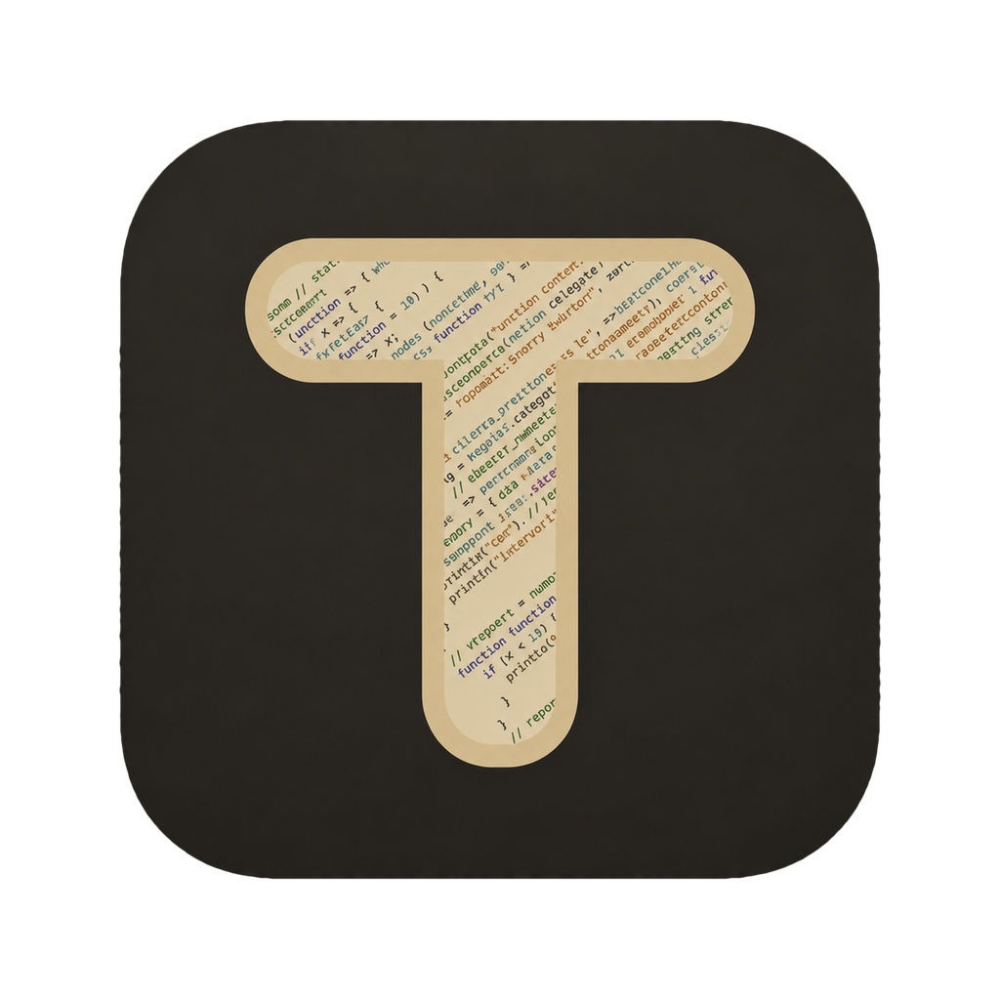
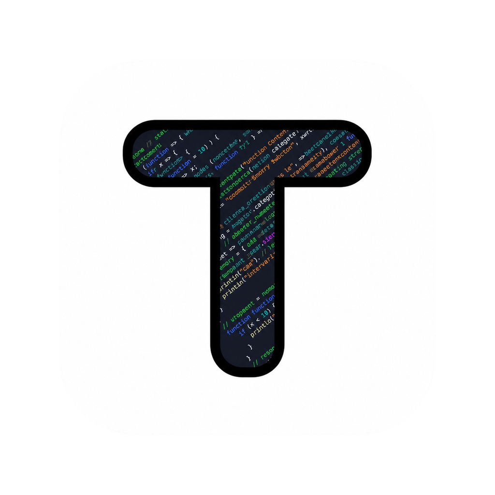

# TodeX 应用图标

两张 1024 × 1024 透明 PNG 是图标源文件，保留用户提供的原始设计与色彩：

| 深色米金 | 浅色 |
| --- | --- |
|  |  |

桌面安装包、窗口及 macOS Dock 固定使用深色米金版。应用界面、网页 favicon 和 README 展示根据对应的明暗主题选择版本；浅色源图不覆盖原生应用图标。

## 原生资源

| 资源 | 用途 |
| --- | --- |
| `build/icon.icns` | macOS 应用包图标，包含 16–1024 像素的标准及 Retina 图层 |
| `build/icon.ico` | Windows 应用、安装包和窗口图标，包含 16、24、32、48、64、128、256 像素图层 |
| `build/icon.png` | 与深色源图完全一致的 1024 像素 PNG，用于 Dock 和 Linux 窗口 |
| `build/icons/*x*.png` | Linux 安装包图标，尺寸为 16、24、32、48、64、128、256、512、1024 像素 |
| `src/renderer/assets/brand/favicon-{dark,light}.png` | 明暗主题网页 favicon，32 像素 |
| `src/renderer/assets/brand/apple-touch-icon.png` | 网页添加到主屏幕时使用的深色图标，180 像素 |
| `src/renderer/public/favicon.ico` | 浏览器默认 favicon，与原生 ICO 一致 |

`electron-builder.yml` 显式指定各平台图标，并通过 `extraResources` 将运行时需要的 PNG 和 ICO 放入安装包的 `resources/icons`（macOS 为 `Contents/Resources/icons`）。主进程在开发模式读取项目的 `build` 目录，安装后读取 `process.resourcesPath` 下的资源，因此两种运行方式都使用同一套图标。

## 更新图标

1. 替换 `src/renderer/assets/brand/` 中的源 PNG，并同步到 Web 项目。
2. 在 macOS 上运行 `pnpm icons:generate`。脚本使用系统自带的 `sips` 缩放 PNG、`iconutil` 生成 ICNS，并将透明 PNG 图层封装为 ICO；不需要额外依赖。
3. 将脚本更新的网页 favicon、触屏图标及 `public/favicon.ico` 同步到 Web 项目，运行两端类型检查与构建，并提交源文件及所有派生图标。

生成产物已纳入版本控制；Windows 和 Linux 的常规构建、CI 打包无需运行生成脚本。

## 配置依据

- [Electron Dock API](https://www.electronjs.org/docs/latest/api/dock#dockseticonimage-macos)：macOS 运行时 Dock 图标。
- [electron-builder 配置](https://www.electron.build/configuration/)：打包配置；同时核对项目安装的 electron-builder 26.15.3 类型定义中的 `mac.icon`、`win.icon`、`linux.icon` 及 `extraResources`。
